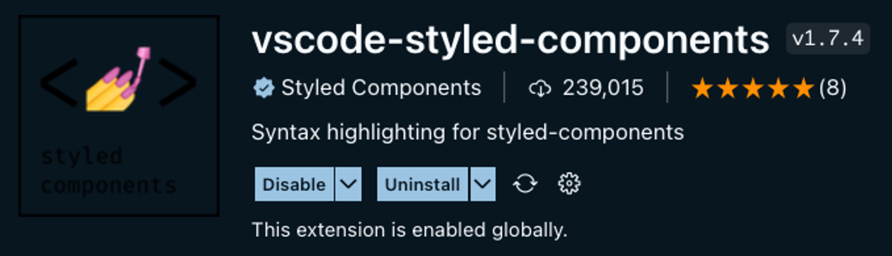
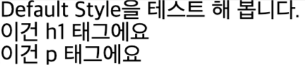
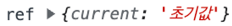
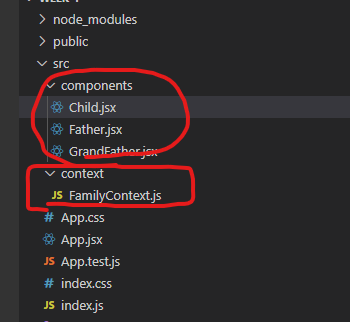
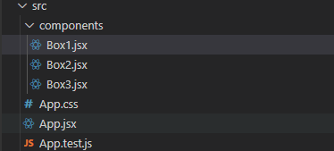
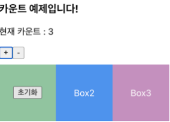
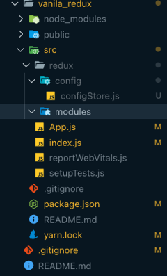

# 01. Styled Components - 소개, 사용  

## 1. CSS-in-Js란?  
> 자바스크립트 코드로 CSS 코드를 작성하여 컴포넌트를 꾸미는 방식  

#### 사용하면 좋은점  
컴포넌트를 만들고 컴포넌트를 꾸미기 위해 css 파일을 만들어서 import 하고 HTML tag 마다 classname를 넣고 CSS 코드를 작성하는 것을 반복하는 것을 줄일 수 있다.  

## 2. styled-components  
- styled-components는 리액트에서 CSS-in-JS 방식으로 컴포넌트를 꾸밀수 있게 도와주는 패키지  

```  
패키지란, React에는 없는 기능이지만 우리가 추가로 가져와서 사용할 수 있는 써드파티 프로그램
패키지들은 누군가에 의해 만들어진 것으로 npm에 모여있다.
사용하고자 하는 패키지를 npm install 또는 yarn add 를 통해서 설치
```  


#### styled-components 준비
-  styled-components 플러그인 설치   


- yarn add styled-components  


#### styled-components 사용하기  
```js
// src/App.js

import React from "react";
// styled-components에서 styled 라는 키워드를 import 합니다.
import styled from "styled-components";

// styled키워드를 사용해서 styled-components 방식대로 컴포넌트를 만듭니다. 
const StBox = styled.div`
	// 그리고 이 안에 스타일 코드를 작성합니다. 스타일 코드는 우리가 알고 있는 css와 동일합니다.
  width: 100px;
  height: 100px;
  border: 1px solid red;
  margin: 20px;
`;

const App = () => {
	// 그리고 우리가 만든 styled-components를 JSX에서 html 태그를 사용하듯이 사용합니다.
  return <StBox>박스</StBox>;
};

export default App;
```  


> 핵심이 되는 코드는 const StBox = styled.div``; 이 부분 이 방식대로 styled-components를 만드는 것  


#### 조건부 스타일링 구현   
```js
// src/App.js

import React from "react";
import styled from "styled-components";

// 1. styled-components를 만들었습니다.
const StBox = styled.div`
  width: 100px;
  height: 100px;
  border: 1px solid ${(props) => props.borderColor}; // 4.부모 컴포넌트에서 보낸 props를 받아 사용합니다. 
  margin: 20px;
`;

const App = () => {
  return (
    <div>
			{/* 2. 그리고 위에서 만든 styled-components를 사용했습니다. */}
			{/* 3. 그리고 props를 통해 borderColor라는 값을 전달했습니다. */}
      <StBox borderColor="red">빨간 박스</StBox>
      <StBox borderColor="green">초록 박스</StBox>
      <StBox borderColor="blue">파랑 박스</StBox>
    </div>
  );
};

export default App;
```    
  


<hr>

<br>
<br>


# 02. Styled Components - GlobalStyles, Sass 소개, css reset
> tyled components는 컴포넌트 내에서만 활용가능하며 공통적으로 들어가야 할 스타일을 적용해야 할 경우 전역적으로(globally)’ 스타일을 지정한다. 라고 표현 그럴 때 적용하는 방법이 바로 전역 스타일링

## 1 GlobalStyles 적용  
> GlobalStyle.jsx  
```js
import { createGlobalStyle } from "styled-components";

const GlobalStyle = createGlobalStyle`
  body {
    font-family: "Helvetica", "Arial", sans-serif;
    line-height: 1.5;
  }
`;

export default GlobalStyle;
```  

> App.jsx
```js
import GlobalStyle from "./GlobalStyle";
import BlogPost from "./BlogPost";

function App() {
	const title = '전역 스타일링 제목입니다.';
	const contents = '전역 스타일링 내용입니다.';
  return (
    <>
      <GlobalStyle />
      <BlogPost title={title} contents={contents} />
    </>
  );
}

export default App;
```

## 2 css reset  
```css
html, body, div, span, applet, object, iframe,
h1, h2, h3, h4, h5, h6, p, blockquote, pre,
a, abbr, acronym, address, big, cite, code,
del, dfn, em, img, ins, kbd, q, s, samp,
small, strike, strong, sub, sup, tt, var,
b, u, i, center,
dl, dt, dd, ol, ul, li,
fieldset, form, label, legend,
table, caption, tbody, tfoot, thead, tr, th, td,
article, aside, canvas, details, embed, 
figure, figcaption, footer, header, hgroup, 
menu, nav, output, ruby, section, summary,
time, mark, audio, video {
	margin: 0;
	padding: 0;
	border: 0;
	font-size: 100%;
	font: inherit;
	vertical-align: baseline;
}
/* HTML5 display-role reset for older browsers */
article, aside, details, figcaption, figure, 
footer, header, hgroup, menu, nav, section {
	display: block;
}
body {
	line-height: 1;
}
ol, ul {
	list-style: none;
}
blockquote, q {
	quotes: none;
}
blockquote:before, blockquote:after,
q:before, q:after {
	content: '';
	content: none;
}
table {
	border-collapse: collapse;
	border-spacing: 0;
}
```  

```js
<!DOCTYPE html>
<html lang="en">
  <head>
    <meta charset="UTF-8" />
    <meta http-equiv="X-UA-Compatible" content="IE=edge" />
    <meta name="viewport" content="width=device-width, initial-scale=1.0" />
    <title>Document</title>
    <link rel="stylesheet" href="./reset.css" />
  </head>
  <body>
    <span>Default Style을 테스트 해 봅니다.</span>
    <h1>이건 h1 태그에요</h1>
    <p>이건 p 태그에요</p>
  </body>
</html>
```  



<hr>

<br>
<br>


# 03. React Hooks

## 1 useState

> 선언  

```js
const [state, setState] = useState(initialState);
```  

> 업데이트   
```js
// 기존에 사용하던 방식
setState(number + 1);

// 함수형 업데이트 
setState(() => {});
```  

🛑 두 방식의 차이점
- 일반 업데이트 방식으로 onClick안에서 setNumber(number + 1) 를 3번 호출해도 number가 1씩 증가한다.
```js
import { useState } from "react";

const App = () => {
  const [number, setNumber] = useState(0);
  return (
    <div>
			{/* 버튼을 누르면 1씩 플러스된다. */}
      <div>{number}</div> 
      <button
        onClick={() => {
          setNumber(number + 1); // 첫번째 줄 
          setNumber(number + 1); // 두번쨰 줄
          setNumber(number + 1); // 세번째 줄
        }}
      >
        버튼
      </button>
    </div>
  );
}

export default App;
```

- 함수형 업데이트 방식으로 동일하게 작동하면 number가 3씩 증가
```js
// src/App.js

import { useState } from "react";

const App = () => {
  const [number, setNumber] = useState(0);
  return (
    <div>
			{/* 버튼을 누르면 3씩 플러스 된다. */}
      <div>{number}</div>
      <button
        onClick={() => {
          setNumber((previousState) => previousState + 1);
          setNumber((previousState) => previousState + 1);
          setNumber((previousState) => previousState + 1);
        }}
      >
        버튼
      </button>
    </div>
  );
}

export default App;
```


🛑 왜  다르게 동작하나?
**일반 업데이트 방식**은 버튼을 클릭했을 때 첫번째 줄 ~ 세번째 줄의 있는 setNumber가 각각 실행되는 것이 아니라, 배치(batch)로 처리한다. **즉 onClick을 했을 때 setNumber 라는 명령을 세번 내리지만, 리액트는 그 명령을 하나로 모아 최종적으로 한번만 실행**을 시킨다. 그래서 setNumber을 3번 명령하던, 100번 명령하던 1번만 실행됨    

<br>   

반면에 **함수형 업데이트 방식**은 **3번을 동시에 명령을 내리면, 그 명령을 모아 순차적으로 각각 1번씩 실행**시킨다.  0에 1더하고, 그 다음 1에 1을 더하고, 2에 1을 더해서 3이라는 결과값을 준다.  

<br>   
<br>   


🛑  왜 리액트팀은 useState가 위 방식으로 동작하도록 만들었을까?
> 공식문서에는 불필요한 리-렌더링을 방지(렌더링 최적화)하기 위해 즉, 리액트의 성능을 위해 한꺼번에 state를 업데이트 한다.


<br>
<br>


## 2 useState
> useEffect는 리액트 컴포넌트가 렌더링될 때마다 특정 작업을 수행하도록 설정할 수 있는 Hook 이다. 즉, 어떤 컴포넌트가 화면에 보여졌을 때 내가 무언가를 실행하고 싶다면? 또는 어떤 컴포넌트가 화면에서 사라졌을 때 무언가를 실행하고 싶다면? useEffect를 사용한다.

<br>

#### 사용 방법
```js
import React, { useEffect } from "react";
```  

```js
// src/App.js

import React, { useEffect } from "react";

const App = () => {

  useEffect(() => {
		// 이 부분이 실행된다.
    console.log("hello useEffect");
  });

  return <div>Home</div>;
}

export default App;
```  


- 활용
```js
import React, { useEffect, useState } from "react";

const App = () => {
  const [value, setValue] = useState("");

  useEffect(() => {
    console.log("hello useEffect");
  });

  return (
    <div>
      <input
        type="text"
        value={value}
        onChange={(event) => {
          setValue(event.target.value);
        }}
      />
    </div>
  );
}

export default App;
```

<br>

#### 의존성 배열
> 배열에 값을 넣으면 그 값이 바뀔 때만 useEffect를 실행하게 된다.

```js
// useEffect의 두번째 인자가 의존성 배열이 들어가는 곳 입니다.
useEffect(()=>{
	// 실행하고 싶은 함수
}, [의존성배열])
```

- 활용
```js
// src/App.js

import React, { useEffect, useState } from "react";

const App = () => {
  const [value, setValue] = useState("");
  useEffect(() => {
    console.log("hello useEffect");
  }, [value]); // value를 넣음

  return (
    <div>
      <input
        type="text"
        value={value}
        onChange={(event) => {
          setValue(event.target.value);
        }}
      />
    </div>
  );
}

export default App;
```

<br>

#### clean up
> 이제 컴포넌트가 사라졌을 때 무언가를 실행하는 것 이 과정을 우리는 클린 업 (clean up) 이라고 표현

```js
// src/App.js

import React, { useEffect } from "react";

const App = () => {

	useEffect(()=>{
		// 화면에 컴포넌트가 나타났을(mount) 때 실행하고자 하는 함수를 넣어주세요.

		return ()=>{
			// 화면에서 컴포넌트가 사라졌을(unmount) 때 실행하고자 하는 함수를 넣어주세요.
		}
	}, [])

	return <div>hello react!</div>
};

export default App;
```
<br>

#### 정리 
- `useEffect`는 화면에 컴포넌트가 mount 또는 unmount 됐을 때 실행하고자 하는 함수를 제어하게 해주는 훅이다.
- **의존성 배열을 통해 함수의 실행 조건을 제어**할 수 있다.
- `useEffect` 에서 함수를 1번만 실행시키고자 할때는 **의존성 배열을 빈 배열**로 둔다.


<hr>
<br>
<br>

## 3 useRef
> DOM 요소에 접근할 수 있도록 하는 React Hook 

- HTML과 javascript를 사용했을 때 특정 DOM을 선택하기 위해서 다음과 같이 했었다.
```js
// (1) getElementById 이용
const divTag = document.getElementById('#myDiv');

// (2) querySelector 이용
const divTag2 = document.querySelector('#myDiv');
```

#### 사용방법
```js
import "./App.css";
import { useRef } from "react";

function App() {
  const ref = useRef("초기값");
  console.log("ref", ref);

  return (
    <div>
      <p>useRef에 대한 이야기에요.</p>
    </div>
  );
}

export default App;
```  

🛑 콘솔을 확인해보면, ref에는 값이 이렇게 담겨있어요.  
> (중요) 이렇게 설정된 ref 값은 컴포넌트가 계속해서 렌더링 되어도 unmount 전까지 값을 유지  
  

🛑 변경도 가능  
```js
import "./App.css";
import { useRef } from "react";

function App() {
  const ref = useRef("초기값");
  console.log("ref 1", ref);

  ref.current = "바꾼 값";
  console.log("ref 1", ref);

  return (
    <div>
      <p>useRef에 대한 이야기에요.</p>
    </div>
  );
}

export default App;
```  

#### state와 ref의 차이점
> state는 변경되면 렌더링이 되고, ref는 변경되면 렌더링이 안된다


#### DOM 접근

- 아이디, 패스워드 입력하는 ui 생성
```js
import "./App.css";

function App() {
  return (
    <>
      <div>
        아이디 : <input type="text" />
      </div>
      <div>
        비밀번호 : <input type="password" />
      </div>
    </>
  );
}

export default App;
```


- 아이디에 포커싱 주기
>     idRef.current.focus(); 사용 

```js
import { useEffect, useRef } from "react";
import "./App.css";

function App() {
  const idRef = useRef("");

  // 렌더링이 될 때
  useEffect(() => {
    idRef.current.focus();
  }, []);

  return (
    <>
      <div>
        아이디 : <input type="text" ref={idRef} />
      </div>
      <div>
        비밀번호 : <input type="password" />
      </div>
    </>
  );
}

export default App;
```


<br>


## 4 useContext(Context API)  
> props는 prop drilling 현상이 발생 => 그래서 등장한 것이 바로 react context API라는 것이구요. useContext hook을 통해 우리는 쉽게 전역 데이터를 관리할 수 있게 되었다.  

```
prop drilling의 문제점

1. 깊이가 너무 깊어지면 이 prop이 어떤 컴포넌트로부터 왔는지 파악이 힘들다
2. 어떤 컴포넌트에서 오류가 발생할 경우 추적이 힘들어지니 유지보수에 힘들다
```


<br>

#### context API 필수 개념  
- `createContext` : context 생성  
- `Consumer` : context 변화 감지  
- `Provider` : context 전달(to 하위 컴포넌트)  

<br>


#### FamilyContext.js, 및 여러 컴포넌트 생성  
  


<br>

- GrandFather.jsx  
```js
import React from "react";
import Father from "./Father";
import { FamilyContext } from "../context/FamilyContext";

function GrandFather() {
  const houseName = "스파르타";
  const pocketMoney = 10000;

  return (
    <FamilyContext.Provider value={{ houseName, pocketMoney }}>
      <Father />
    </FamilyContext.Provider>
  );
}

export default GrandFather;
```  

<br>

-  Father.jsx
```js
import React from "react";
import Child from "./Child";

function Father() {
  return <Child />;
}

export default Father;
```


<br>

- Child.jsx
```js
import React, { useContext } from "react";
import { FamilyContext } from "../context/FamilyContext";

function Child() {

  const stressedWord = {
    color: "red",
    fontWeight: "900",
  };

  const data = useContext(FamilyContext);
  console.log("data", data);

  return (
    <div>
      나는 이 집안의 막내에요.
      <br />
      할아버지가 우리 집 이름은 <span style={stressedWord}>{data.houseName}</span>
      라고 하셨어요.
      <br />
      게다가 용돈도 <span style={stressedWord}>{data.pocketMoney}</span>원만큼이나
      주셨답니다.
    </div>
  );
}

export default Child;
```   

<br>


GrandFather → Context(중앙 관리소) → Child 순서로 잘 전달이 됐다.

🛑 useContext를 사용할 때, Provider에서 제공한 value가 달라진다면 useContext를 사용하고 있는 모든 컴포넌트가 리렌더링 된다. 따라서 value 부분을 항상 신경써줘야 함


<hr>
<br>
<br>

## 5 React.memo
> memo(React.memo) : 컴포넌트를 캐싱
- 리-렌더링의 발생 조건 중 3번째 경우. 즉, 부모 컴포넌트가 리렌더링 되면 자식컴포넌트는 모두 리렌더링 된다는 것은 그림으로 보면   
- 1번 컴포넌트가 리렌더링 된 경우, 2~7번이 모두 리렌더링 된다.  
- 4번 컴포넌트가 리렌더링 된 경우, 6, 7번이 모두 리렌더링 된다.  
  


#### 사용법
>  디렉토리 구성은 컴포넌트로 Box1 ~ 3 까지 있고 App.jsx에서 상태를 업데이트할 경우 하위 컴포넌트는 전부 리렌더링된다.
  


> export default 이후에 React.mem를 감싸주면 해당 컴포넌트는 부모컴포넌트가 리렌더링 되더라도 리렌더링 되지 않습니다.  
```js
export default React.memo(Box1);
export default React.memo(Box2);
export default React.memo(Box3);
```


<br>


## 6 useCallback
> React.memo는 컴포넌트를 메모이제이션 했다면, useCallback은 인자로 들어오는 함수 자체를 메모이제이션 한다.


#### 문제
> Box1이 만일, count를 초기화 해 주는 코드라고 가정했을 때   

- App.jsx
```js

	// count를 초기화해주는 함수
  const initCount = () => {
    setCount(0);
  };

  return (
    <>
      <h3>카운트 예제입니다!</h3>
      <p>현재 카운트 : {count}</p>
      <button onClick={onPlusButtonClickHandler}>+</button>
      <button onClick={onMinusButtonClickHandler}>-</button>
      <div style={boxesStyle}>
        <Box1 initCount={initCount} />
        <Box2 />
        <Box3 />
      </div>
    </>
  );

``` 
​

- Box1.jsx  
```js

function Box1({ initCount }) {
  console.log("Box1이 렌더링되었습니다.");

  const onInitButtonClickHandler = () => {
    initCount();
  };

  return (
    <div style={boxStyle}>
      <button onClick={onInitButtonClickHandler}>초기화</button>
    </div>
  );
}

```

```
+ 버튼이나, - 버튼을 누를 때 그리고 초기화 버튼을 누를 때 모두 
App 컴포넌트와 Box1 컴포넌트가 리렌더링 되는 것을 볼 수 있다. 
App.jsx가 리렌더링 되면서 코드가 다시 만들어지기 때문
```



#### useCallback 사용법
>  아래처럼 useCallback으로 감싸주면 ox1.jsx 컴포넌트는 리렌더링이 안된다.  
```js
// 변경 전
const initCount = () => {
  setCount(0);
};

// 변경 후
const initCount = useCallback(() => {
  setCount(0);
}, []);


// count가 업데이트 될 경우에는 리렌더링 해줘 라는 뜻이다.
const initCount = useCallback(() => {
  console.log(`[COUNT 변경] ${count}에서 0으로 변경되었습니다.`);
  setCount(0);
}, [count]);
```


<br>

## 7 useMemo
>  처음 해당 값을 반환할 때 그 값을 메모리에 저장하고 이러한 기법을 캐싱을 한다. 라고 표현


####  사용방법1

- App.jsx
```js
import "./App.css";
import HeavyComponent from "./components/HeavyComponent";

function App() {
  const navStyleObj = {
    backgroundColor: "yellow",
    marginBottom: "30px",
  };

  const footerStyleObj = {
    backgroundColor: "green",
    marginTop: "30px",
  };

  return (
    <>
      <nav style={navStyleObj}>네비게이션 바</nav>
      <HeavyComponent />
      <footer style={footerStyleObj}>푸터 영역이에요</footer>
    </>
  );
}

export default App;
```  

- components > HeavyComponent.jsx
```js
import React, { useState, useMemo } from "react";

function HeavyButton() {
  const [count, setCount] = useState(0);

  const heavyWork = () => {
    for (let i = 0; i < 1000000000; i++) {}
    return 100;
  };

	// CASE 1 : useMemo를 사용하지 않았을 때
  const value = heavyWork();

	// CASE 2 : useMemo를 사용했을 때
  // const value = useMemo(() => heavyWork(), []);

  return (
    <>
      <p>나는 {value}을 가져오는 엄청 무거운 작업을 하는 컴포넌트야!</p>
      <button
        onClick={() => {
          setCount(count + 1);
        }}
      >
        누르면 아래 count가 올라가요!
      </button>
      <br />
      {count}
    </>
  );
}

export default HeavyButton;
```


####  사용방법2
> useEffect hook을 이용해서 me의 정보가 바뀌었을 때만 발동되게끔 dependency array를 넣어놨지만 엉뚱하게도 count를 증가하는button을 눌러보면 계속 log가 찍히는 것을 볼 수가 있다.

```js
import React, { useEffect, useState } from "react";

function ObjectComponent() {
  const [isAlive, setIsAlive] = useState(true);
  const [uselessCount, setUselessCount] = useState(0);

  const me = {
    name: "Ted Chang",
    age: 21,
    isAlive: isAlive ? "생존" : "사망",
  };

  useEffect(() => {
    console.log("생존여부가 바뀔 때만 호출해주세요!");
  }, [me]);

  return (
    <>
      <div>
        내 이름은 {me.name}이구, 나이는 {me.age}야!
      </div>
      <br />
      <div>
        <button
          onClick={() => {
            setIsAlive(!isAlive);
          }}
        >
          누르면 살았다가 죽었다가 해요
        </button>
        <br />
        생존여부 : {me.isAlive}
      </div>
      <hr />
      필요없는 숫자 영역이에요!
      <br />
      {uselessCount}
      <br />
      <button
        onClick={() => {
          setUselessCount(uselessCount + 1);
        }}
      >
        누르면 숫자가 올라가요
      </button>
    </>
  );
}

export default ObjectComponent;
```

```
**왜 그럴까요?**

불변성과 관련이 있다.

위 예제에서 버튼이 선택돼서 `uselessCount state`가 바뀌게 되면
→ 리렌더링이 되죠
→ 컴포넌트 함수가 새로 호출됩니다
→ me 객체도 다시 할당해요(이 때, 다른 메모리 주소값을 할당받죠)
→ useEffect의 dependency array에 의해 me 객체가바뀌었는지 확인해봐야 하는데
→ 이전 것과 모양은 같은데 주소가 달라요!
→ 리액트 입장에서는 me가 바뀌었구나 인식하고 useEffect 내부 로직이 호출됩니다.
```

- 해결법
> useMemo를 활용하여 uselessCount가 아무리 증가돼도 영향이 없게 됩니다  
> useMemo를 남발하게 되면 별도의 메모리 확보를 너무나 많이 하게 되기 때문에 오히려 성능이 악화될 수 있습니다. 필요할 때만 쓰기로 합시다 🙂

```js
const me = useMemo(() => {
  return {
    name: "Ted Chang",
    age: 21,
    isAlive: isAlive ? "생존" : "사망",
  };
}, [isAlive]);
```


<hr>
<br>
<br>


# 04. Redux 소개
> “중앙 state 관리소”를 사용할 수 있게 도와주는 전역 상태 관리 라이브러리  
> useState를 통해 상태를 관리했을 때 발생하는 불편함을 일부 해소 ex) props drilling...    


<br>
<br>

### 특징
- 리덕스는 **전역상태 관리 라이브러리**이다.
- 리덕스는 **useState를 통해 상태를 관리했을 때 발생하는 불편함을 일부 해소**시켜준다.
- 리덕스는 `중앙 State 관리소`를 가지고 있으며, 모든 State는 이곳에서 생성된다.
- **useState로 생성한 State는 Local State**이고, **리덕스에서 생성한 State는 Global State**이다.


<br>

```
- Local state (지역상태) 란?
    - **컴포넌트에서 useState를 이용해서 생성한 state 입니다.** 좁은 범위 안에서 생성된 State 라고 생각하시면 됩니다.
- Global state (전역상태)란?
    - Global state는 컴포넌트에서 생성되지 않습니다.  중앙화 된 특별한 곳에서 State들이 생성됩니다. 좀 더 쉽게 얘기해서  “중앙 state 관리소” 라고 생각하면 됩니다.
```


<hr>
<br>
<br>


# 05. Redux 설정

### 리덕스 설치  
> 리액트에서 리덕스를 사용하기 위해서는 2개의 패키지를 설치해야 한다.  
   
```  
yarn add redux react-redux

# 아래와 같은 의미
yarn add redux
yarn add react-redux
```  

<br>
<br>


### 폴더 구조 생성하기


이미지와 같이 폴더 구조를 생성하세요.  

1. `src` 폴더 안에 `redux` 폴더를 생성
2. `redux` 폴더 안에 `config`, `modules` 폴더를 생성
3. `config` 폴더 안에 `configStore.js`파일을 생성합니다. 

각각의 폴더와 파일은 역할이 있습니다.

- `redux` : 리덕스와 관련된 코드를 모두 모아 놓을 폴더 입니다.
- `config` : 리덕스 설정과 관련된 파일들을 놓을 폴더 입니다.
- `configStore` : “중앙 state 관리소" 인 Store를 만드는 설정 코드들이 있는 파일 입니다.
- `modules` : 우리가 만들 State들의 그룹이라고 생각하면 됩니다. 예를 들어 `투두리스트`를 만든다고 한다면, 투두리스트에 필요한 `state`들이 모두 모여있을 `todos.js`를 생성하게 되텐데요, 이  `todos.js` 파일이 곧 하나의 모듈이 됩니다.

<br>
<br>


### src/configStore.js
```js
import { createStore } from "redux";
import { combineReducers } from "redux";

/*
1. createStore()
리덕스의 가장 핵심이 되는 스토어를 만드는 메소드(함수) 입니다. 
리덕스는 단일 스토어로 모든 상태 트리를 관리한다고 설명해 드렸죠? 
리덕스를 사용할 시 creatorStore를 호출할 일은 한 번밖에 없을 거예요.
*/

/*
2. combineReducers()
리덕스는 action —> dispatch —> reducer 순으로 동작한다고 말씀드렸죠? 
이때 애플리케이션이 복잡해지게 되면 reducer 부분을 여러 개로 나눠야 하는 경우가 발생합니다. 
combineReducers은 여러 개의 독립적인 reducer의 반환 값을 하나의 상태 객체로 만들어줍니다.
*/

const rootReducer = combineReducers({}); 
const store = createStore(rootReducer); 

export default store; 
```  

<br>
<br>


### index.js 
```js
// 원래부터 있던 코드
import React from "react";
import ReactDOM from "react-dom/client";
import App from "./App";
import reportWebVitals from "./reportWebVitals";

// 우리가 추가할 코드
import store from "./redux/config/configStore";
import { Provider } from "react-redux";

const root = ReactDOM.createRoot(document.getElementById("root"));
root.render(

	//App을 Provider로 감싸주고, configStore에서 export default 한 store를 넣어줍니다.
  <Provider store={store}> 
    <App />
  </Provider>
);

// If you want to start measuring performance in your app, pass a function
// to log results (for example: reportWebVitals(console.log))
// or send to an analytics endpoint. Learn more: https://bit.ly/CRA-vitals
reportWebVitals();
```

<br>
<br>


### 정리 
- 리액트에서 리덕스를 사용하려면, `redux`, `react-redux` 가 필요하다.
- 설정코드는 지금 당장 이해 할 필요가 없다.
- “중앙 State 관리소"를 Store (스토어)라고 부른다.
- 모듈이란, State들이 그룹이다.


<hr>
<br>
<br>

# [06]. Redux useSelecter 및 dispatch

<br>

## 1 modules 폴더에 counter.js 파일을 생성
```js

// 초기 상태값 (state)
const initialState = {
    number: 0
}

//리듀서 : state에 변화를 일으키는 함수
// (1) : state를 action의 type에 따라 변경하는 함수
//input : state와 action
const counter = (state = initialState, action) => {
    switch (action.type) {
        default:
            return state;
    }
}


export default counter;

```

<br>

🛑 모듈의 구성요소 알아보기

- 1-1 초기 상태값
이것은 initialState 입니다. 단어 그대로 초기 상태값 입니다. 즉, 어떤 State의 초기값을 정해주는 것 입니다. 우리가 useState를 사용했을 때 괄호 안에 초기값을 지정해주던 것과 같은 이치입니다.   
```js
  // 초기 상태값
const initialState = {
  number: 0,
};
```    

- 1-2 Reducer  
리듀서란, 변화를 일으키는 함수입니다. action에 type으로 어떤 동작을 이르키는 함수 입니다.
```js
// 리듀서 
const counter = (state = initialState, action) => {
  switch (action.type) {
    default:
      return state;
  }
};
```


## 2 스토어에 연결
- configStore.js로 이동 해서 counter를 추가한다.
```js
// 새롭게 추가한 부분
import counter from "../modules/counter";

const rootReducer = combineReducers({
  counter: counter, // <-- 새롭게 추가한 부분
});
```

<br>
<br>

## 3 App.js 컴포넌트에서 확인
```JS
// src/App.js

import React from "react";
import { useSelector } from "react-redux"; // import 해주세요.

const App = () => {
  const counterStore = useSelector((state) => state); // 추가해주세요.
  console.log(counterStore); // 스토어를 조회해볼까요?

  return <div></div>;
}

export default App;
```


🛑 number에 접근하기  
```JS
const number = useSelector(state => state.counter.number); // 0
```  

<hr>
<br>
<br>


## 4 리덕스의 흐름 도식화  

  

1. View 에서 액션이 일어난다.
2. dispatch 에서 action이 일어나게 된다.
3. action에 의한 reducer 함수가 실행되기 전에 middleware가 작동한다.
4. middleware 에서 명령내린 일을 수행하고 난뒤, reducer 함수를 실행한다. (3, 4번은 아직 몰라도 됩니다!)
5. reducer 의 실행결과 store에 새로운 값을 저장한다.
6. store의 state에 subscribe 하고 있던 UI에 변경된 값을 준다.
출처 : https://velog.io/@annahyr/리덕스-흐름-이해하기   


<br>
<br>

## dispatch 사용하기  
- `useDispatch();` 함수를 사용해서 dispatch를 사용할 수 있다.  

> 예시  디스패치를 이용해서 액션객체를 리듀서로 보낼 수 있습니다.
```js
import React from "react";
import { useDispatch } from "react-redux"; // import 해주세요.

const App = () => {
  const dispatch = useDispatch(); // dispatch 생성
  return (
    <div>
      <button
				// 이벤트 핸들러 추가
        onClick={() => {
					// 마우스를 클릭했을 때 dispatch가 실행되고, ()안에 있는 액션객체가 리듀서로 전달된다.
          dispatch({ type: "PLUS_ONE" }); 
        }}
      >
				+ 1
      </button>
    </div>
  );
};

export default App;
```  

> 리듀서에서 type이 PLUS_ONE 일 경우로 핸들링해준다. 
```js
// src/modules/counter.js

// 초기 상태값
const initialState = {
  number: 0,
};

// 리듀서
const counter = (state = initialState, action) => {
  console.log(action);
  switch (action.type) {
		// PLUS_ONE이라는 case를 추가한다.
		// 여기서 말하는 case란, action.type을 의미한다.
		// dispatch로부터 전달받은 action의 type이 "PLUS_ONE" 일 때
		// 아래 return 절이 실행된다. 
    case "PLUS_ONE":
      return {
				// 기존 state에 있던 number에 +1을 더한다.
        number: state.number + 1,
      };

    default:
      return state;
  }
};

// 모듈파일에서는 리듀서를 export default 한다.
export default counter;
```

  
<br>
<br>


## 정리
- 액션객체란, 반드시 type이란 key를 가져야 하는 객체이다. 또한 리듀서로 보낼 “명령"이다.  
- 디스패치란, 액션객체를 리듀서로 보내는 “전달자” 함수이다.  
- 리듀서란, 디스패치를 통해 전달받은 액션객체를 검사하고, 조건이 일치했을 때 새로운 상태값을 만들어내는 “변화를 만들어내는" 함수이다.  
- 디스패치(dispatch)를 사용하기위해서는 useDispatch() 라는 훅을 이용해야 한다.    
```  
  - 디스패치는 스토어의 내장함수 중 하나입니다.
  - 우선, 디스패치는 액션을 발생 시키는 것 정도로 이해하시면 됩니다.
  - dispatch 라는 함수에는 액션을 파라미터로 전달합니다.. dispatch(action) 이런식으로 말이죠.
```  
- 액션객체 type의 value는 대문자로 작성한다. (JS에서 상수는 대문자로 작성하는 룰이 있음)  


<hr>  
<br>
<br>


# [07]. Action Creator

<br>

## 1 Action Creator 란?

>  액션객체를 한 곳에서 관리할 수 있도록 “함수"와 액션 value를 상수만들어 둔 함수
```js
const PLUS_ONE = "PLUS_ONE"; // value는 상수로 생성

// 액션객체를 반환하는 함수 생성
// export 가 붙는 이유는 plusOne()는 밖으로 나가서 사용될 예정이기 때문입니다.
export const plusOne = () => { 
  return {
    type: PLUS_ONE, // type에는 위에서 만든 상수로 사용 (vscode에서 자동완성 지원)
  };
};
```

> 더이상 ` dispatch({ type: "PLUS_ONE" });` 이렇게 쓸 필요없이 함수를 사용해 dispatch로 전달할 수 있다.  
```js
 return (
    <div>
      {number}
      <button
        onClick={() => {
          dispatch(plusOne()); // 액션객체를 Action creator로 변경합니다.
        }}
      >
        + 1
      </button>
      {/* 빼기 버튼 추가 */}
      <button
        onClick={() => {
          dispatch(minusOne()); // 액션객체를 Action creator로 변경합니다.
        }}
      >
        - 1
      </button>
    </div>
  );
};
```

<br>
<br>


## 2 Action Creator 를 왜 사용할까?
- 휴먼에러 (오타) 방지
- 유지보수의 효율성 증가
- 코드 가독성 
- 리덕스 공식문서에서 소개되고 있는 방법

<br>

## 3 정리  
- 액션객체를 만드는 함수를 `Action Creator`(액션 크리에이터)라고 한다.
- `Action Creator`는 모듈 파일안에서 생성된다.
- 액션객체의 type value로 상수로 생성해서 관리한다.
- `Action Creator`를 사용하면, 여러가지 문제점을 해소할 수 있다.  


<hr>
<br>
<br>

# [08]. Payload

## 1.Payload란?
> React에서 “payload”는 일반적으로 액션(action) 객체 내에 전달되는 데이터를 의미  

ex1 )   

```js
{type: "ADD_NUMBER", payload: 10} // type뿐만 아니라 payload라는 key와 value를 같이 담는다.
```  

ex2 )
```js
{
  type: 'ADD_TODO',
  payload: {
    id: 1,
    text: 'Buy milk',
    completed: false
  }
}
```  

<hr>
<br>
<br>

# [09]. Ducks 패턴

## 1. Ducks 패턴이란?
> 리덕스를 사용하기 위해서는 결국 우리가 리덕스의 구성요소를 모두 만들어야만 사용이 가능합니다. Erik Rasmussn 라는 개발자가 이것을 패턴화하여 작성하는 것을 제안했는데, 그것이 바로 Ducks패턴이다.    


🛑 `**Erik Rasmussen` 이 제안한 Ducks 패턴은 아래의 내용을 지켜 모듈을 작성하는 것 입니다.**  
1. Reducer 함수를 `export default` 한다.
2. Action creator 함수들을 `export` 한다.
3. Action type은 `app/reducer/ACTION_TYPE` 형태로 작성한다.  

(외부 라이브러리로서 사용될 경우 또는 외부 라이브러리가 필요로 할 경우에는 UPPER_SNAKE_CASE 로만 작성해도 괜찮다.)  
그래서 모듈 파일 1개에 `Action Type`, `Action Creator`, `Reducer` 가 모두 존재하는 작성방식입니다.  
