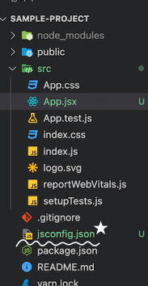

# 1-4 개발환경 셋팅

### 1. 크롬 설치
- [크롬 다운로드](https://www.google.com/intl/ko_kr/chrome/)

### 2. 비주얼 스튜디오 설치
- [비주얼 스튜디오 다운로드](https://visualstudio.microsoft.com/ko/downloads/)

### 3. git 설치
- [git 다운로드](https://git-scm.com/downloads)

### 4. node.js 설치
- [node.js 다운로드](https://nodejs.org/ko/)
  
 > node 설치 확인하기
  ```
  node -v
  ```


### 5. yarn 설치
- 터미널에서 yarn 설치  
  ```bash
  npm install -g yarn
  ```
  
- yarn 설치 확인  
  ```
  yarn -v 
  ```

### 6. npm과 yarn에 대해  
 **공통적 특징** 
 1. 둘다 자바스크립트 **런타임 환경** 인 노트(Node.js)의 패키지 관리자  
 2. 애플의 앱스토어, 구글의 플레이스토어처럼, 전 세계의 많은 개발자들이 본인들이 만든 유용하고 다양한 패키지들 또는 프로그램을 ‘온라인 데이터베이스’에 올려놓는다. 그걸 쉽게 설치하고 삭제할 수 있도록 도와주는 관리자
  
    
#### **차별적 특징**
- NPM
    1. node.js를 설치할 때 자동으로 생성
    2. Node Package Manager의 약자
    3. NPM platform 자체
- YARN
    1. 2016년에 페이스북에서 개발한 패키지 관리자
    2. npm과의 호환성이 좋고, 속도나 안정성 측면에서 npm보다 월등히 좋다.
- 요약
    1. 속도 : Yarn wins
    2. 보안 : Yarn wins(하지만 최근 npm의 보안 업데이트도 크게 향상)
 

- 명령어  


<br>


# 1-5 CRA(Create React App)
```
[학습 목표]

1. CRA의 개념에 대해 설명할 수 있습니다.
2. CRA 명령어로 프로젝트를 생성하고 열 수 있습니다.
3. 왜 CRA로 생성한 웹 애플리케이션이 열리게 되는지 대략적인 흐름을 설명할 수 있습니다.
4. 상대경로와 절대경로의 개념에 대해 숙지하고, 리액트 프로젝트 내에서 절대경로를 사용하는 방법을 알 수 있습니다.
```


## 1 CRA란 무엇일까요?
한 줄의 명령어 입력으로 React 프로젝트 개발에 필수요소를 자동으로 구성하는 방법, React 프로젝트를 구성하기 위해 필요한 것들은 상당히 많은데 이러한 것들을 신경쓰지 않아도 알아서 만들어준다.


## 2 CRA로 프로젝트 생성하기
```
ls #현재 내가 위치하고 있는 곳이 어디인지 확인

cd 폴더이름 #리액트 프로젝트를 생성하고 싶은 폴더로 접근

yarn create react-app week-1 #프로젝트 생성!
```


## 3 CRA로 생성한 프로젝트 실행하기
```
cd week-1 # week-1 폴더로 이동
```

```
yarn start # 프로젝트 시작 

or 

npm start # 프로젝트 시작 
```


## 4 프로젝트 구조를 살짝 뜯어보기

대략적인 흐름 
public > index.html
→ src > index.js
→ src > App.js

결국, 중요한 것은 [우리의 플레이그라운드는 ‘App.js’라는 것]


## 5 상대경로 import → 절대경로 지정하기
jsconfig.json 파일을 생성(반드시 root 경로에)


```json
{
	"compilerOptions": {
		"baseUrl": "src"
	},
	"include": ["src"]
}
```  


<br>


# 1-6 React Component

## 1 React Component란 
컴포넌트 개념 이해하기     

```
컴포넌트를 통해 UI를 재사용이 가능한 개별적인 여러 조각으로 나누고, 각 조각을 개별적으로 볼 수 있다.
개념적으로 컴포넌트는 JavaScript 함수와 유사하고
“props”라고 하는 임의의 입력을 받은 후, 화면에 어떻게 표시되는지를 기술하는 React 엘리먼트를 반환
```  


## 2 리액트 컴포넌트를 표현하는 두 가지 방법

- 두 가지 모두 기능상으로는 동일하지만, 공식 홈페이지에서는 함수형 컴포넌트를 사용하기를 권장   

> 함수형 컴포넌트  
```TypeScript
// props라는 입력을 받음
// 화면에 어떻게 표현되는지를 기술하는 React 엘리먼츠를 반환(return)

function Welcome(props) {
  return <h1>Hello, {props.name}</h1>;
}

// 훨씬 쉬운 표현을 해보면 아래와 같죠.
function App () {
	return <div>hello</div>
}
```  

> 클래스형 컴포넌트  
```TypeScript
class Welcome extends React.Component {
  render() {
    return <h1>Hello, {this.props.name}</h1>;
  }
}
```  
<br>

# 1-7 부모-자식 컴포넌트

## 1 컴포넌트 안에 컴포넌트 넣기  
- 컴포넌트는 다른 컴포넌트를 품을 수 있다. 이때 다른 컴포넌트를 품는 컴포넌트를 부모 컴포넌트라고 부르고, 다른 컴포넌트 안에서 품어지는 컴포넌트를 자식 컴포넌트라고 부른다.


```TypeScript
// src/App.js
import React from "react";

function Child() {
  return <div>나는 자식입니다.</div>;
}

function App() {
  return <Child />;
}

export default App;
```


